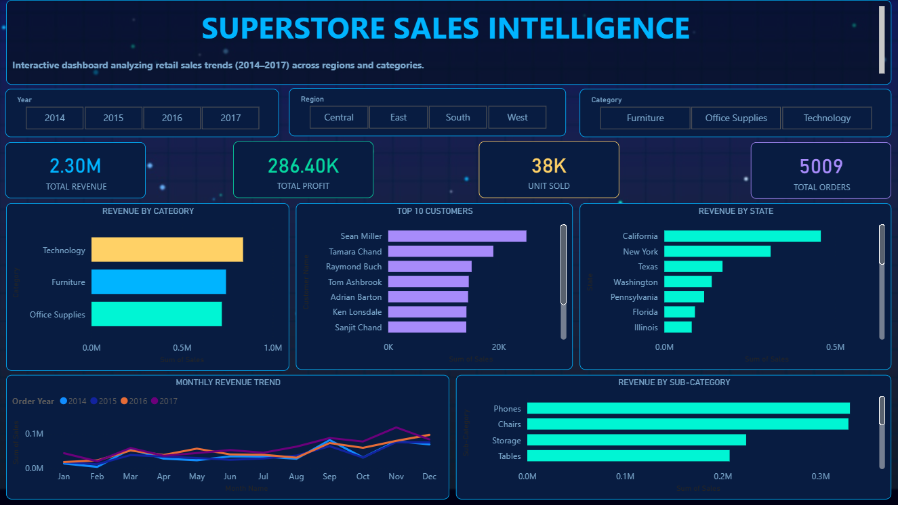

# 🛒 Superstore Sales Analysis — End-to-End Data Analytics Project

> Complete data analytics project covering Python, SQL, and Power BI on the US Superstore retail dataset



---

## 📌 Project Overview

An end-to-end data analytics project that covers the **complete data analyst workflow** — from raw data to business insights — using three industry-standard tools.

| Tool | Purpose | File |
|------|---------|------|
| 🐍 Python (Pandas, Matplotlib, Seaborn) | Data Cleaning + EDA | `cleaning_and_eda.ipynb` |
| 🗄 SQL (MySQL) | Business Queries + Analysis | `superstore.sql` |
| 📊 Power BI | Interactive Dashboard | `SALES_DASHBOARD.pbix` |

---

## 📊 Dataset Information

| Property | Details |
|----------|---------|
| Dataset | US Superstore Sales Dataset |
| Rows | 9,994 transactions |
| Columns | 26 features |
| Time Period | 2014 – 2017 |
| Geography | United States (49 states) |

---

## 🗂 Project Structure

```
superstore-sales-analysis/
│
├── 📓 cleaning_and_eda.ipynb     ← Python: Data cleaning + EDA (48 cells)
├── 🗄 superstore_queries.sql             ← SQL: 14 business queries
├── 📊 SALES_DASHBOARD.pbix       ← Power BI: Interactive dashboard
├── 📄 superstore_clean.csv       ← Cleaned dataset output
├── 🖼 dashboard_preview.png      ← Dashboard screenshot
└── 📝 README.md                  ← Project documentation
```

---

## 🐍 Phase 1 — Python: Data Cleaning & EDA

### Cleaning Steps Performed
1. Loaded raw dataset with correct encoding
2. Converted `Order Date` and `Ship Date` from text to datetime
3. Checked and confirmed no null values
4. Removed duplicate rows
5. Stripped whitespace from all text columns
6. Created new features — `Order Year`, `Order Month`, `Month Name`, `Shipping Days`, `Profit Margin %`

### 8 Business Questions Answered

| # | Business Question | Finding |
|---|------------------|---------|
| 1 | Which Category generates most Revenue? | Technology leads at $836K |
| 2 | Which Region performs best? | West region has highest revenue |
| 3 | What is the Monthly Revenue Trend? | Clear Q4 seasonality every year |
| 4 | Which Sub-Categories are losing money? | Tables, Bookcases show negative profit |
| 5 | Does higher Discount reduce Profit? | Yes — discounts above 20% hurt margins |
| 6 | Who are Top 10 Customers? | Sean Miller leads at ~$25K |
| 7 | Which Segment is most valuable? | Consumer segment dominates |
| 8 | What is the Yearly Revenue Growth? | Consistent growth 2014–2017 |

### Libraries Used
```python
import pandas as pd
import numpy as np
import matplotlib.pyplot as plt
import seaborn as sns
```

---

## 🗄 Phase 2 — SQL Analysis

### 14 Queries Written

| Query | Concept Used | Business Purpose |
|-------|-------------|-----------------|
| Overall Business Summary | Aggregation | KPI overview |
| Revenue by Category | GROUP BY | Category performance |
| Top 10 Customers | ORDER BY + LIMIT | Customer value |
| Monthly Revenue Trend | DATE_FORMAT + GROUP BY | Seasonality |
| Revenue by Region & Category | Multiple GROUP BY | Regional analysis |
| Customers Above Average | Subquery | High-value targeting |
| Month over Month Growth | LAG Window Function | Growth tracking |
| Rank Products by Profit | RANK + PARTITION BY | Product ranking |
| States with Negative Profit | HAVING | Loss detection |
| Top Customer per Region | ROW_NUMBER + PARTITION BY | Regional leaders |
| Shipping Analysis | DATEDIFF + AVG | Logistics performance |
| Yearly Growth | LAG + Year functions | YoY comparison |
| Discount Impact on Profit | CASE WHEN buckets | Pricing strategy |
| Customer Segmentation | Multiple aggregations | Segment analysis |

### Key SQL Concepts Demonstrated
- ✅ Window Functions — `LAG`, `RANK`, `ROW_NUMBER`, `PARTITION BY`
- ✅ Subqueries — nested SELECT statements
- ✅ CASE WHEN — conditional bucketing
- ✅ Date Functions — `DATE_FORMAT`, `DATEDIFF`, `YEAR`
- ✅ HAVING vs WHERE — filtered aggregations
- ✅ NULLIF — division by zero protection

---

## 📊 Phase 3 — Power BI Dashboard

### Dashboard Features
- **4 KPI Cards** — Revenue, Profit, Units Sold, Total Orders
- **5 Interactive Charts** — Category, Customers, State, Monthly Trend, Sub-Category
- **3 Dynamic Slicers** — Year, Region, Category
- **Cross-filtering** — Click any visual to filter entire dashboard
- **Dark professional theme** — Consistent color scheme

### Key Metrics
| Metric | Value |
|--------|-------|
| Total Revenue | $2.30M |
| Total Profit | $286.40K |
| Units Sold | 38K |
| Total Orders | 5,009 |
| Profit Margin | 12.5% |

---

## 💡 Key Business Insights

1. **Technology** generates the highest revenue ($836K) but **Furniture** has the lowest profit margin
2. **California** contributes the most to total revenue ($458K) — nearly 20% of all sales
3. **Q4 (Oct-Dec)** shows consistent sales spikes across all 4 years — seasonal demand
4. **Tables and Bookcases** are loss-making sub-categories — need repricing strategy
5. **Discounts above 20%** consistently result in negative profit — risky discount policy
6. **Consumer segment** accounts for the majority of orders but **Corporate** has higher average order value
7. **West region** leads in revenue while **Central region** has the lowest performance
8. Business shows **consistent year-over-year growth** from 2014 to 2017

---

## 🚀 How to Run This Project

### Python Notebook
```bash
# Install required libraries
pip install pandas numpy matplotlib seaborn jupyter

# Open the notebook
jupyter notebook cleaning_and_eda.ipynb
```

### SQL Queries
```sql
-- 1. Create database
CREATE DATABASE superstore_database;

-- 2. Import superstore_clean.csv into MySQL as table named 'superstore'
-- Use MySQL Workbench: Server → Data Import → CSV

-- 3. Run queries from superstore.sql
```

### Power BI Dashboard
1. Download [Power BI Desktop](https://powerbi.microsoft.com/downloads/) (free)
2. Open `SALES_DASHBOARD.pbix`
3. Interact with slicers and charts

---

## 🛠 Tools & Technologies

| Tool | Version | Purpose |
|------|---------|---------|
| Python | 3.x | Data cleaning and EDA |
| Pandas | Latest | Data manipulation |
| Matplotlib + Seaborn | Latest | Data visualization |
| MySQL | 8.x | SQL analysis |
| Power BI Desktop | Latest | Dashboard creation |

---

## 📈 Skills Demonstrated

- ✅ Data Cleaning and Preprocessing
- ✅ Exploratory Data Analysis (EDA)
- ✅ Statistical Analysis and Interpretation
- ✅ Data Visualization (Python + Power BI)
- ✅ SQL — Beginner to Advanced queries
- ✅ Window Functions and Subqueries
- ✅ Business Intelligence Dashboard Design
- ✅ Storytelling with Data
- ✅ Deriving Actionable Business Insights

---
## 💼 Business Recommendations

Based on the analysis, here are actionable insights for the business:

1. **Furniture is loss-making** → Reduce heavy discounts on Tables and Bookcases
2. **California drives 20% of revenue** → Increase marketing budget in West region
3. **Q4 always peaks (Oct–Dec)** → Stock up inventory before October every year
4. **Discounts above 20% hurt profit** → Cap discount policy at 20% maximum
5. **Corporate segment has higher order value** → Target corporate clients for bulk deals
